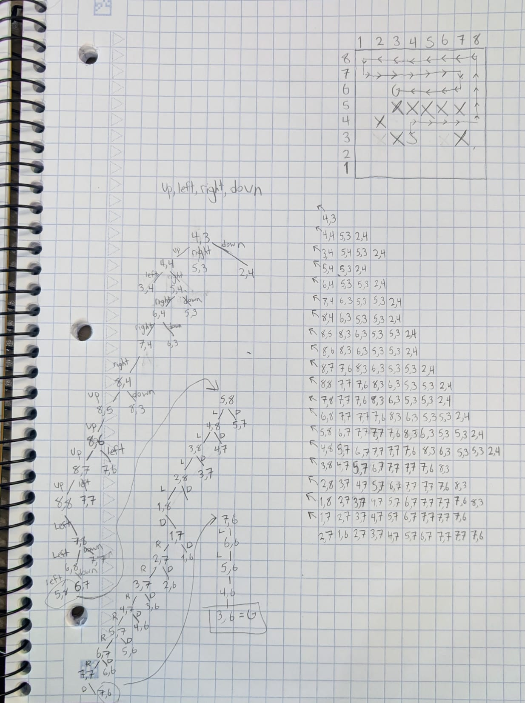

# CPSC 3750 –Artificial Intelligence – Winter 2025 Assignment 1 [140 points]

## Written Part 

## 1. [20 points]  
For each of the following activities, give a description of:
- the task (i.e., performance measure), 
- the environment, 
- the actions, and 
- the sensors,  
and characterize the environment in terms of 
- fully observable vs. partially observable, 
- single agent vs. multiagent, 
- deterministic vs. stochastic , 
- static vs. dynamic, and 
- discrete vs. continuous.

### 1. Playing Soccer
- **The Task:** Work with your teammates to get the soccer ball into the opposing team's goal more times than they get it into your team's goal. (Performance measures are maximizing number of points scored by your team and minimizing the opponent's goals)
- **Environment:** One large field, 22 players (11 on each side), two goals, one ball, boundary lines
- **Actions:** Move, kick the ball
- **Sensors:** Sees the whole field including all the players, the ball, the goals 
- **The environment is:**  
    - fully observable  
    - multiagent,  
    - stochastic ,  
    - dynamic, and  
    - continuous.  
### 2. Bidding on an item at an auction
- **The Task:** Obtain the items you want to buy, by spending the least amount of money possible. (Performance measures: amount of money spent vs number desired items obtained)
- **Environment:** Auctioneer, bidders, items to bid on, money held by each bidder
- **Actions:** Bid/raise bid, wait
- **Sensors:** Detects what the item is, most recent (highest) bid, own remaining currency  
- **The environment is:** 
    - partially observable (you can't detect how much money other bidders have),
    - multiagent,  
    - stochastic,  
    - dynamic,  
    - discrete (assuming bidders can raise bids by a fixed amount, there is a fixed number of bidders, each bidder has a finite amount of money, and there are a finite amount of items to be sold at the auction) 

## 2. [20 points]  
Give a complete problem formulation for each of the following:  
- You have three jugs measuring 12 liters, 8 liters and 3 liters, and a water faucet. You
can fill a jug, empty it, pour water from one jug into another, or pour it onto the
ground. Your goal is to measure exactly six liters.
    - **Search State Space:** Three jugs (empty, or each fully or partially filled)
    - **Successor Function:** Fill up any jug, or empty any jug into any other jug or onto the ground
    - **Initial State:** 3 empty jugs
    - **Goal State:** Either the 12 liter jug or the 8 liter jug is filled with exactly 6L of water

- Knuth conjectured that starting with the number 4, a sequence of square root, floor,
and factorial operations can reach any desired positive integer. For example, we can
reach 5 from 4 as follows:  
`b√√√√√√√√√√√√(4!)!c = 5`  
    - **Search State Space:** All positive real numbers that can result from any combination of the number 4 and the square root, floor, and factorial operations
    - **Successor Function:** Square root, floor, and factorial operations
    - **Initial State:** The number 4
    - **Goal State:** Reach exactly the target number, which must be a positive integer (5 in the example)

## 3. [40 points]  
Consider the problem of finding a path in the grid shown on Figure 1 from the position S to the position G.  
The agent can move on the grid horizontally and vertically, one square at a time (each step has a cost of one). 
No step may be made into a forbidden crossed area.  
*NOTE: You can number the squares from left to right from 1 to 8, and from bottom to up from 1 to 8*  
```
  12345678
8 OOOOOOOO
7 OOOOOOOO
6 OOGOOOOO
5 OOXXXXXO
4 OXOOOOOO
3 OOXSOOXO
2 OOOOOOOO
1 OOOOOOOO
```
**(a) What is a state? How many states are in this state space?**
There is one state is any location of the agent. Since the agent cannot move to crossed out squares, the number of states in the state space can be calculated by subtracting the number of crossed out squares from the total area of the grid.  
Since the grid is 8x8, there are 64 total squares, and there are 8 invalid squares, so there are a total of (8*8)-8 = ***56 valid states in the state space.***  

**(b) For each of the following searches, draw the search tree:**  
NOTE: I am only including valid states in the tree, so **no crossed-out squares** or **squares that have already been visited**. 
- A **depth-first search** from S to G, given that the order of the operators you will test is: up, left, right, then down. Draw the search tree until you reach the solution.  
  
- A **breadth-first search** from S to G, given that the order of the operators you will test is: up, left, right, then down. Draw the search tree until the depth of 5.
 

## Programming Part
## 1. [60 points] 
Given a grid similar to the one in Figure 1. You may prompt the user to: enter: 
- the width and the height of the grid, 
- the start and the goal states, and 
- the forbidden squares.  
Implement each of the following searches and show the solutions:  
(a) A depth-first search from S to G, given that the order of the operators you will test
is: up, left, right, then down.  
(b) A breadth-first search from S to G, given that the order of the operators you will test
is: up, left, right, then down.  
(c) An iterative deepening depth-first search from S to G, given that the order of the
operators you will test is: up, left, right, then down. At what depth the solution is
reached?  