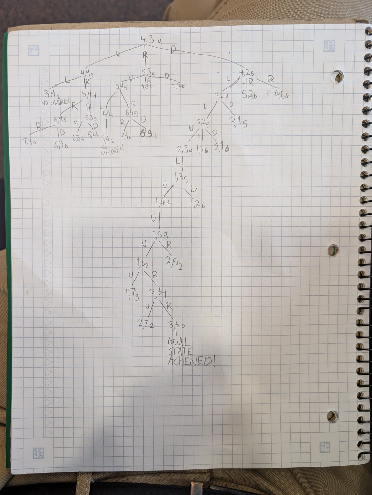
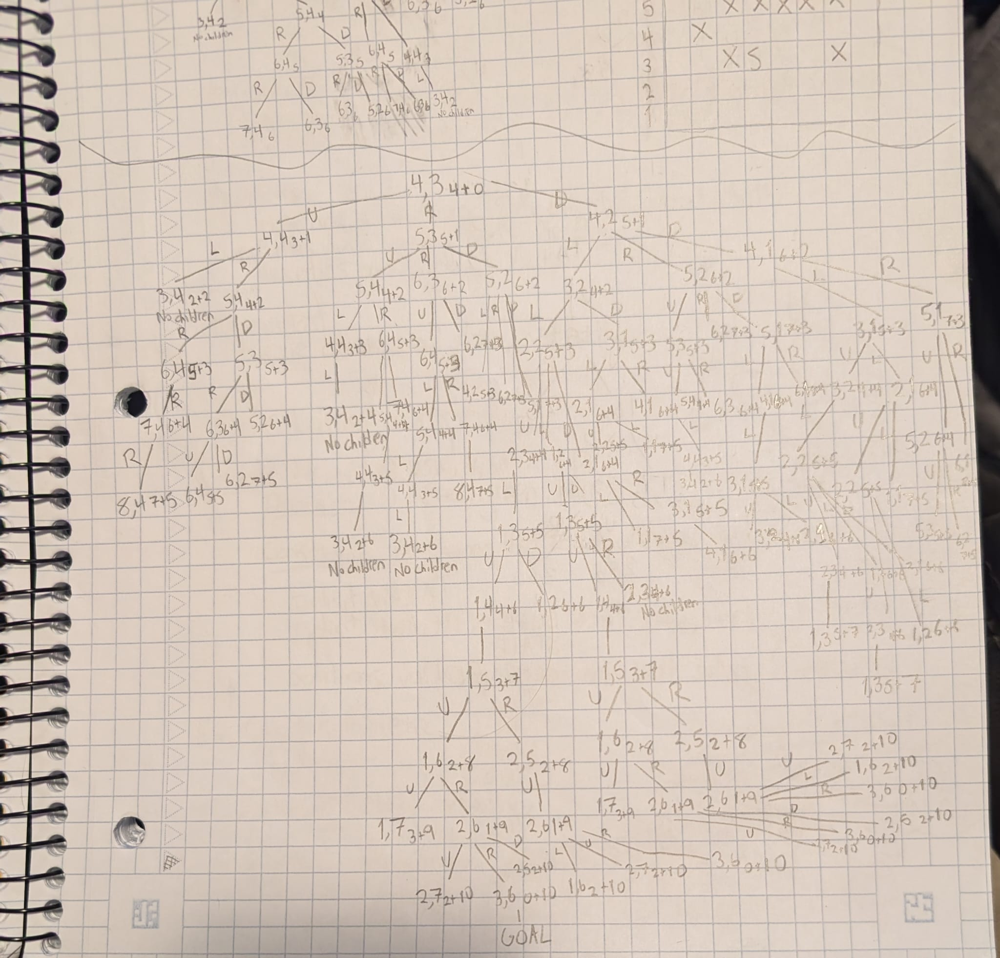
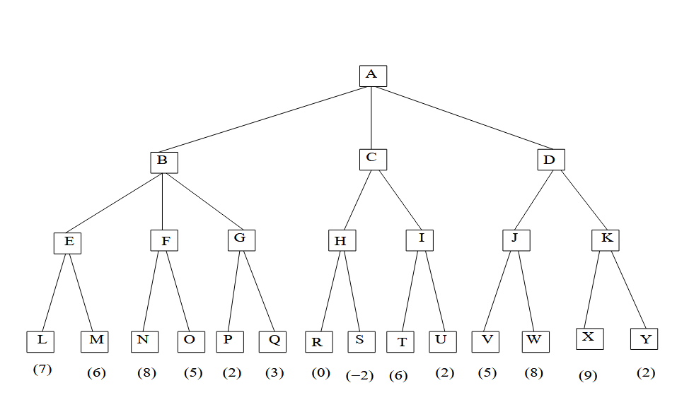

## John S. Anvik
## Student ID # 001224816
# CPSC 3750 – Artificial Intelligence – Winter 2026 Assignment 2 [140 points]

## Written Part
### 1. [40 points]
Consider the problem of finding a path in the grid shown below from the position S to the position G.  
```
 12345678
8--------
7--------
6--G-----
5--XXXXX-
4-X------
3--XS--X-
2--------
1--------
```  
The agent can move on the grid horizontally and vertically, one square at a time (each step has a cost of one).  
No step may be made into a forbidden crossed area. In the case of ties, break it using up, left, right, and down.  
  
**(a) Draw the search tree in a greedy search. Manhattan distance should be used as the heuristic function. That is, h(n) for any node n is the Manhattan distance from n to G. The Manhattan distance between two points is the distance in the x-direction plus the distance in the y-direction. It corresponds to the distance traveled along city streets arranged in a grid. For example, the Manhattan distance between G and S is 4. What is the path that is found by the greedy search?**  
NOTE: Heuristic value ties were broken by expanding the **shallowest node** first (to find the optimal (least costly) solution). Beyond that, ties were broken **based on direction**, in the following order: up, left, right, down.  

The path was: 
4,3   4,2   3,2   2,2   2,3  1,3  1,4   1,5   1,6   2,6   3,6  
Directions taken to get to that path:
D   L   L   U   L   U   U   U   R   R  
  
**(b) Draw the search tree in an A∗ search. Manhattan distance should be used as the heuristic function. What is the path that is found by the A∗ search?**   
  
The path was: 
4,3   4,2   3,2   2,2   2,3  1,3  1,4   1,5   1,6   2,6   3,6  
Directions taken to get to that path:
D   L   L   U   L   U   U   U   R   R  
  
### 2. [40 points]  
Consider the following game tree in which the static scores are all from the first player’s point of view:  
  
**(a) Suppose the first player is the maximizing player. What move should be chosen?**  
The first player should **choose D**, which will cause the second player to choose J, and the first player will then choose W and end with a score of 8.  
**(b) What nodes would not need to be examined using the alpha-beta pruning procedure?**  
Nodes I (and its children, T and U) and O do not need to be examined.  
**(c) Suppose now the first player is the minimizing player. What move should be chosen?**  
The first player should **choose C**, then the second player will choose I, and the first player will then choose U, ending with a score of 2.  
**(d) What nodes would not need to be examined using the alpha-beta pruning procedure?**  
Nodes K (and its children, X and Y) and Q do not need to be examined.  

## Programming Part
### 1. [60 points]  
You are given a grid similar to the one above. You may prompt the user to enter the width and the height of the grid, the start and the goal states, and the forbidden squares.  
Manhattan distance should be used as the heuristic function, and ties are solved using up, left, right, and down.  
Implement each of the following searches and show the solutions:  
**(a) Greedy search from S to G.**  
Implemented using a priority queue, where priority is given to squares with the lowest manhattan distance  
**(b) A∗ search from S to G.**  
Implemented using a priority queue, where priority is given to squares with the lowest (manhattan distance from goal + number of moves taken)  
**(c) UCS search from S to G.**  
NOTE: UCS search where every movement has a cost of 1 is equivalent to Breadth First Search
  