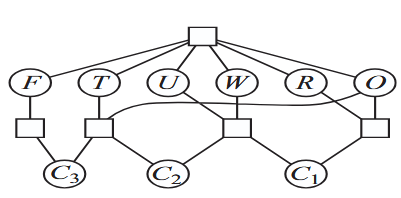
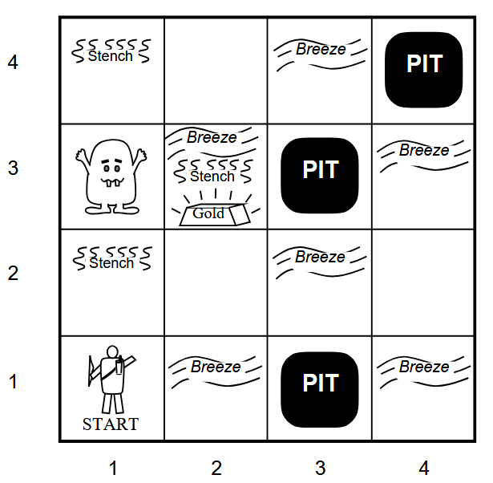

## John S. Anvik
## Student ID # 001224816
# CPSC 3750 – Artificial Intelligence – Winter 2026 - Assignment 3 [130 points]
Due on March 20, 2026  
## Non Programming Part [70 points]
### 1. [10 points]
Give precise formulation for the following as constraint satisfaction problems:
- Class scheduling: There is a fixed number of professors and classrooms, a list of classes to be offered, and a list of possible time slots for classes. Each professor has a set of classes that they can teach.
### 2. [20 points]
Solve the following cryptarithmetic problem by hand, using the strategy of backtracking with forward checking, most constrained variable, and least-constraining-value heuristics.  

```
 TWO
+TWO
____
FOUR
```



### 3. [15 points]
Assume the following tree-structured CSP, where you have 6 regions that should be colored using 2 different colors given no 2 neighboring regions with the same color. How the algorithm for tree-stuctured CSPs will solve this problem? Explain.  

### 4. [10 points]
Consider the Wumpus world:  



Using resolution by refutation, show the following:  
(a) W1,3  

### 5. [15 points]
Convert the following set of sentences to CNFs:  
- S1 : A ⇐⇒ (B ∨ E)  
- S2 : E =⇒ D  
- S3 : C ∧ F =⇒ ¬B  
- S4 : E =⇒ B  
- S5 : B =⇒ F  
- S6 : B =⇒ C  

Use resolution to prove ¬B.  

## Programming Part [60 points]
Using the CSPs, implement the N-queen problem, with the local search and iterative improvement algorithm.